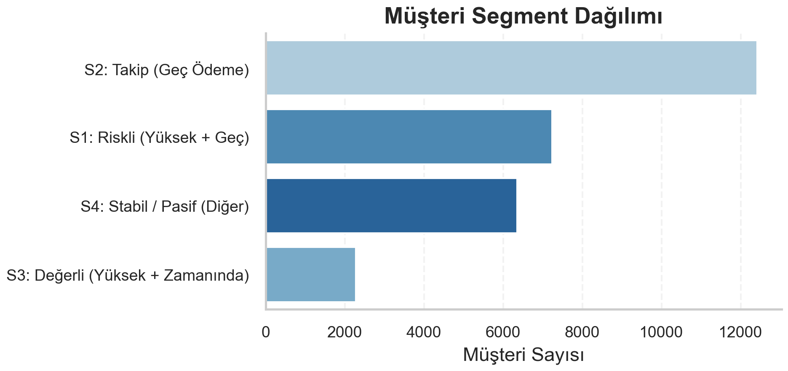

# Energy Consumption, Customer Segmentation & Collection Risk Analysis
**Case Study — Decision-Focused Energy Retail Analytics**



## Project Snapshot
- **Domain:** Energy Retail Analytics  
- **Focus:** Customer Segmentation & Collection Risk  
- **Data Size:** ~2.7M records  
- **Tools:** Python, Pandas, Seaborn  
- **Output:** Decision-oriented operational insights  

## Project Overview
This project analyzes energy consumption behavior, customer segmentation, and payment collection risk to generate decision-support insights for operational teams.

The analysis enables organizations to:
- Understand district-level consumption differences  
- Identify high-value and high-risk customer segments  
- Prioritize collection strategies using measurable financial impact  
- Support operational planning through data-driven insights  

The project is structured as a three-notebook analytical pipeline:
**Data Exploration → Visualization → Decision Storytelling**

---

## Business Problem
Energy retail companies face several operational challenges:
- Consumption patterns and customer structures differ significantly across districts  
- Applying the same collection strategy to all customers reduces operational efficiency  
- The combination of high consumption and delayed payment represents the highest financial risk  

This project provides a data-driven answer to:
> **Which customer segment and which district require which operational action?**

---

## Analytical Approach
The analytical workflow consists of three complementary layers:

### 1 — District Consumption Profiling
- District-level consumption intensity and customer density analysis  
- Customer class distribution comparison  
- Seasonality and extreme consumption behavior analysis  
- District profile scorecard creation  

### 2 — Customer Segmentation
- Customers segmented based on consumption level and payment behavior  
- Segment size and characteristics analyzed  
- “High Consumption + Late Payment” segment clearly isolated  

### 3 — Collection Risk Analysis
- Identification of drivers influencing payment behavior  
- Risk concentration analysis by district, account class, and consumption segment  
- Evaluation of payment channels together with collection risk  

---

## Notebook Workflow

### Notebook 01 — Data Exploration & Preparation
**Focus**
- Data structure validation (`.info`, `.describe`, `.head`)  
- Customer count comparison by district  
- Dataset merging and record validation  
- Missing, negative, and extreme value detection  
- Consumption statistics by account class  
- Export of cleaned datasets for downstream analysis  

**Outputs**
- Cleaned datasets saved as intermediate files (pickle format)

### Notebook 02 — Comparative Visualization
**Focus**
- District-level account class distributions  
- Seasonal consumption trends  
- Collection channel and district distributions  
- On-time vs late payment ratios  
- Consumption distribution and outlier visualization  

**Outputs**
- Analytical charts supporting comparative insights  

### Notebook 03 — Decision Storytelling & Insights
**Focus**
- District comparison analysis and drivers  
- Customer segmentation and behavioral interpretation  
- Collection risk identification  
- Business-oriented action recommendations  

**Structure**
Problem Definition → Hypotheses → Analysis → Findings → Business Recommendations

---

## Key Insights
- Consumption and customer profiles vary significantly across districts  
- The High Consumption + Late Payment segment represents the most critical financial risk  
- Customer class and profile strongly influence payment behavior  
- Segment-based collection strategies significantly improve operational efficiency  

---

## Decision Impact
This analysis enables operational teams to:
- Identify high-risk customer segments early  
- Prioritize collection and communication resources based on financial impact  
- Design segment-specific payment incentives (auto-pay, installment plans, reminders)  
- Support district-level operational planning with data-driven evidence  

**Example Action Maps**
- **High Consumption + Late Payment:** early warning alerts, auto-pay incentives, structured payment plans  
- **High Consumption + On-Time Payment:** loyalty programs, auto-pay adoption expansion  
- **Low/Medium Consumption + Late Payment:** low-cost reminder systems, online/bank payment channel promotion  

---

## Repository Structure
```text
case_study_02_energy-consumption-customer-risk-analytics/
├── README.md
├── data/
│   └── elektrik_veri_hashed.xlsx
├── notebooks/
│   ├── notebook_01_data_exploration.ipynb
│   ├── notebook_02_visualization.ipynb
│   └── notebook_03_decision_storytelling.ipynb
├── outputs/
│   └── figures/
│       ├── 01_district_account_structure.png
│       ├── 02_monthly_consumption_trend.png
│       ├── 03_payment_status_distribution.png
│       ├── 04_district_account_class_consumption.png
│       ├── 05_district_scorecard.png
│       ├── 06_customer_segment_distribution.png
│       ├── 07_segment_avg_consumption.png
│       ├── 08_payment_behavior_by_segment.png
│       ├── 09_consumption_by_payment_boxplot.png
│       ├── 10_bank_collection_rate_by_district.png
│       └── 11_late_payment_rate_by_district_segment.png
└── requirements.txt
```

## Data Privacy
The original dataset contains sensitive operational information and is not publicly shared.  
All customer identifiers are anonymized/hashed, and therefore the dataset included in this repository is either anonymized or excluded for privacy reasons.

---

## How to Run

### 1. Install Required Libraries
```bash
pip install -r requirements.txt
```

## 2. Run Notebooks Sequentially

   1. **notebook_01_data_exploration.ipynb**
     - Performs data validation and cleaning
     - Exports intermediate cleaned datasets

   2. **notebook_02_visualization.ipynb**
      - Uses cleaned datasets to produce comparative visualizations

  3. **notebook_03_decision_storytelling.ipynb**
       - Generates decision-oriented analytical storytelling and operational recommendations

---

## Tools
- **Python:** pandas, numpy  
- **Visualization:** matplotlib, seaborn  
- **Environment:** Jupyter Notebook  

---

## Business Value
This project demonstrates how energy retail companies can identify high-risk customer segments and prioritize collection strategies through data-driven segmentation and consumption analytics.  
The insights support more efficient operational planning and measurable financial impact.

---

## Final Insight
The project illustrates how consumption analytics, customer segmentation, and payment behavior modeling can be integrated into a scalable decision-support framework.  
Such frameworks can be operationalized through automated analytical pipelines and decision dashboards to support real-world collection prioritization strategies.
